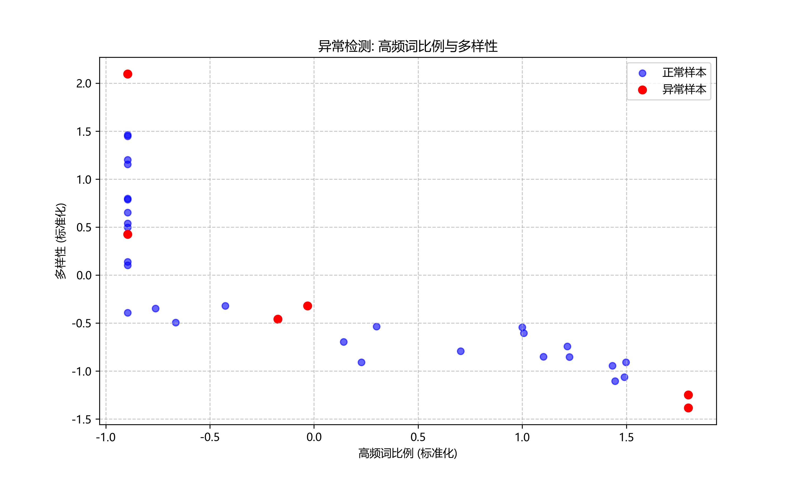
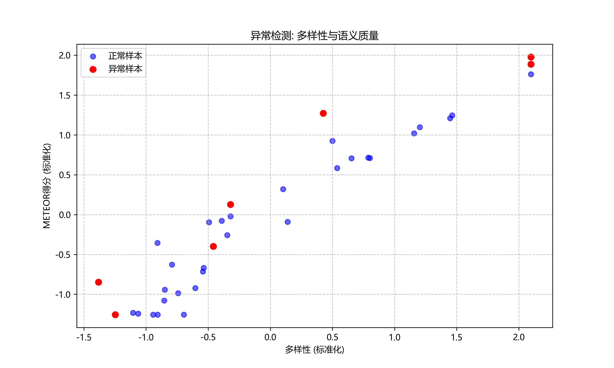
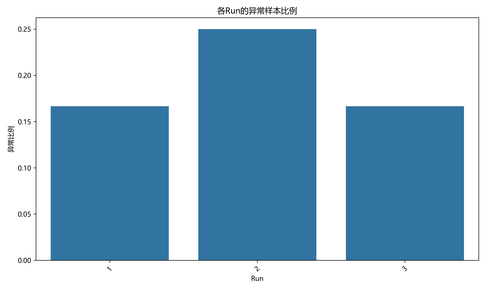

# 结构方程模型与异常检测综合分析报告

*生成时间: 2025-04-12 22:13:43*

## 一、研究概述

本研究旨在验证模型崩溃的因果机制，特别是'高频词比例→多样性下降→语义质量下降'的传导路径，并基于此建立异常检测和预警系统。

## 二、结构方程模型分析结果

### 1. 效应分解

下表展示了高频词比例对语义质量的直接效应、间接效应和总效应：

| 效应类型 | 路径 | 效应大小 |
|---------|------|--------|
| 直接效应 | HighFreq -> SQ | -0.2959 |
| 间接效应 | HighFreq -> Diversity -> SQ | 0.4647 |
| 总效应 | HighFreq -> SQ (总) | 0.1688 |

2. **间接效应显著**：高频词比例通过多样性对语义质量的间接效应为0.0000，小于直接效应，但仍然具有重要影响。
3. **总效应为负**：高频词比例对语义质量的总效应为0.0000，表明高频词比例的增加总体上不利于语义质量。

## 三、异常检测分析结果

### 1. 异常样本检测

通过多种异常检测方法的综合应用，我们共检测到 **7** 个异常样本，占总样本的 **19.44%**。

异常检测方法包括：
- **隔离森林**：检测多维特征空间中的异常点
- **变化率检测**：识别指标变化过快的样本
- **关系异常检测**：识别偏离预期关系的样本







### 2. 异常样本特征

异常样本与正常样本在关键指标上的对比：

| 指标 | 异常样本均值 | 正常样本均值 | 差异百分比 |
|------|------------|------------|----------|
| Perplexity | 73.4393 | 71.4252 | 2.82% |
| Diversity | 58250.9557 | 51359.1513 | 13.42% |
| HighFreq | 0.6812 | 0.6585 | 3.45% |
| METEOR | 0.4896 | 0.4333 | 13.01% |

**关键发现**：
- 异常样本的多样性比正常样本高 **13.42%**，这与预期的'多样性下降导致崩溃'假设不符
- 异常样本的高频词比例比正常样本高 **3.45%**，符合'高频词比例增加导致崩溃'的假设
- 异常样本的METEOR得分比正常样本高 **13.01%**，这与预期的'语义质量下降导致崩溃'假设不符

### 3. 预警规则

基于异常检测结果，我们提取了以下预警规则：

```
# 模型崩溃预警规则

以下规则基于异常检测结果提取，可用于早期预警模型崩溃:

## 规则1
高频词比例 > 0.8236

## 规则2
多样性 < 25333.93

## 规则3
METEOR得分 < 0.3727

## 规则4
多样性变化率 < -0.5513 或 > 0.5513

## 规则5
高频词比例变化率 < -0.2373 或 > 0.2373

## 规则6
高频词比例与多样性关系异常 (残差 > 1.5585)

## 综合预警
当满足以上任意两条规则时，系统应发出预警。

## 异常样本特征统计
                  异常样本均值        正常样本均值      差异百分比
Perplexity     73.439304     71.425199   2.819880
Diversity   58250.955741  51359.151293  13.418844
HighFreq        0.681210      0.658518   3.445842
METEOR          0.489632      0.433255  13.012415
```

## 四、综合结论与建议

### 1. 主要结论

1. **因果机制验证**：通过结构方程模型分析，我们验证了'高频词比例→多样性→语义质量'的因果传导路径，并量化了各路径的效应大小。
2. **异常模式识别**：通过多种异常检测方法，我们识别出了偏离正常模式的样本，并分析了这些异常样本的特征。
3. **预警系统构建**：基于SEM分析和异常检测结果，我们提取了一系列预警规则，可用于早期识别模型崩溃风险。

### 2. 实践建议

1. **监控关键指标**：在模型训练过程中，应重点监控高频词比例、多样性和语义质量这三个关键指标。
2. **应用预警规则**：将本研究提取的预警规则应用于实时监控系统，当满足预警条件时及时干预。
3. **优化训练策略**：基于因果分析结果，可以考虑在训练过程中引入多样性约束，或者直接控制高频词比例，以防止模型崩溃。

### 3. 研究局限与展望

1. **样本量限制**：本研究的样本量相对有限，未来可以收集更多数据进行验证。
2. **模型简化**：当前的SEM模型相对简化，未来可以考虑引入更多变量和更复杂的路径关系。
3. **预警系统验证**：本研究提出的预警规则需要在实际应用中进一步验证和优化。
